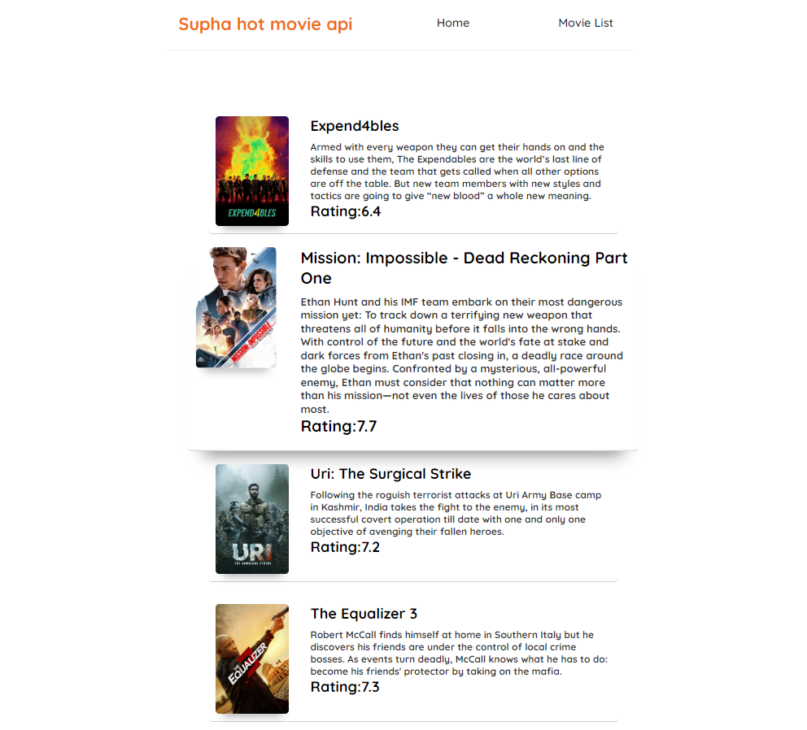

# React-Movie

## Overview
A web app made with the React library.
Used as a web client for a previous minimal API project.
TMDB is used as a source for external API.
This web application was made with the React library.
https://www.themoviedb.org/

## Web App
Persons on the home/main page are clickable and will get you to their "profile" where various other options are available.
Within each profile, you can:
- Add a favorite genre
- Add a new movie
- Rate and add movies
- View all genres
- View all movies added
- View the rating of a movie

<picture>

</picture>

## Reflection
After a while into the project, I realized that the minimal API I used for the project where lacking in API calls, and the structure could use a big improvement to optimize the web application.
I could have gone back and changed a lot of structure but I did not, i wanted to learn how to handle the problems and what to think of next time I build a database.
The styling is still a work in progress

## Tools

All of the tools used during the development of this program:

#### Integrated Development Environment (IDE)

- Visual Studio Code

#### Dependencies / Packages

- React 18.2.0
- Axios 1.4.0
- React router dom 6.11.1
- Vite 4.3.2

#### Languages

- HTML5
- CSS
- JavaScript
